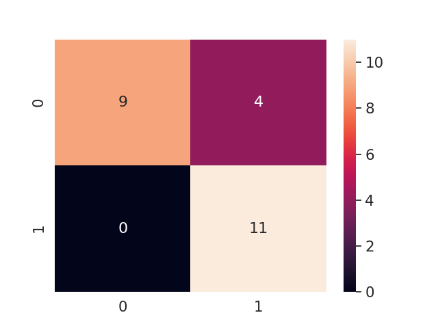

# COVID-PY
Diagnostico de COVID19 usando CNN

- Basado en el dataset propuesto por https://github.com/ieee8023/covid-chestxray-dataset

Resultados obtenidos con primera Version utilizando Transfer Learning sobre VGG16

# Modo de Uso
- Train_pipeline.py puede ser obtenido para obtener el dataset y generar la arquitectura base
- image_dataset_gen.py permite filtrar los datos a partir del dataset propuesto
# Disclaimer
 Version inicial probada con un dataset extremadamente pequeño, aunque los resultados demuestran que no hay Falsos Negativos debido al tamaño reducido del dataset no se puede considerar valido con fines medicos
 
